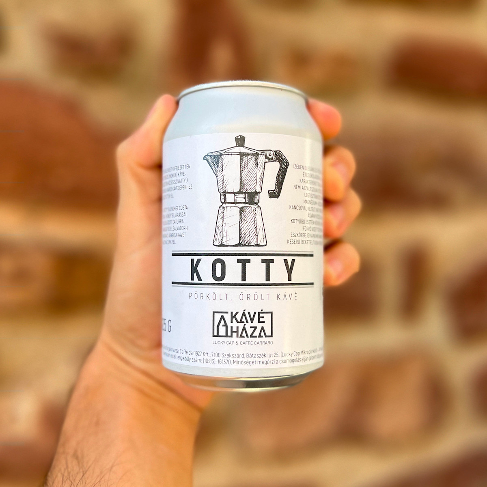

I visit local cafes at least twice a month and usually buy beans from Hungarian micro-roasters. I've mostly been interested in filter roasts, but recently I came across a blend specifically for the moka pot in an unusual package.

After a while I decided to give it a try and bought a *can*. As far as I know, Lucky Cap Roastery is the first from Hungary to have a plantation in Lourdes, Costa Rica. The coffees that come from this place are branded "Bányai" and the above is no exception.

They have very specific instructions on how to prepare it, even down to the filtered water you should use. I already prepare drinks in the moka pot in a very specific way, so this came as no surprise, but it still brought a smile to my face.

To be honest, I'm always skeptical of pre-ground coffee, but this was one of my top five drinks made this way. They promise a spicy dark chocolate flavor with subtle dried plum undertones. I definitely sensed the former, but the fruitiness was absent. This is most likely due to the fact that my palate is far from ideal and I do not really go beyond taste profiling.

Anyway, this endeavor triggered something in me to be more conscious about the whole coffee experience and it is better to articulate my thoughts than keep them to myself. This was one of the reasons I decided to start blogging again. With this in mind, I have turned my Moleskine notebook into a diary where I will keep a log of the coffees I taste and my opinions about them. Some of it may end up here.

---

kotty
: Short for *kotyogós*, the Hungarian nickname for the moka pot.
