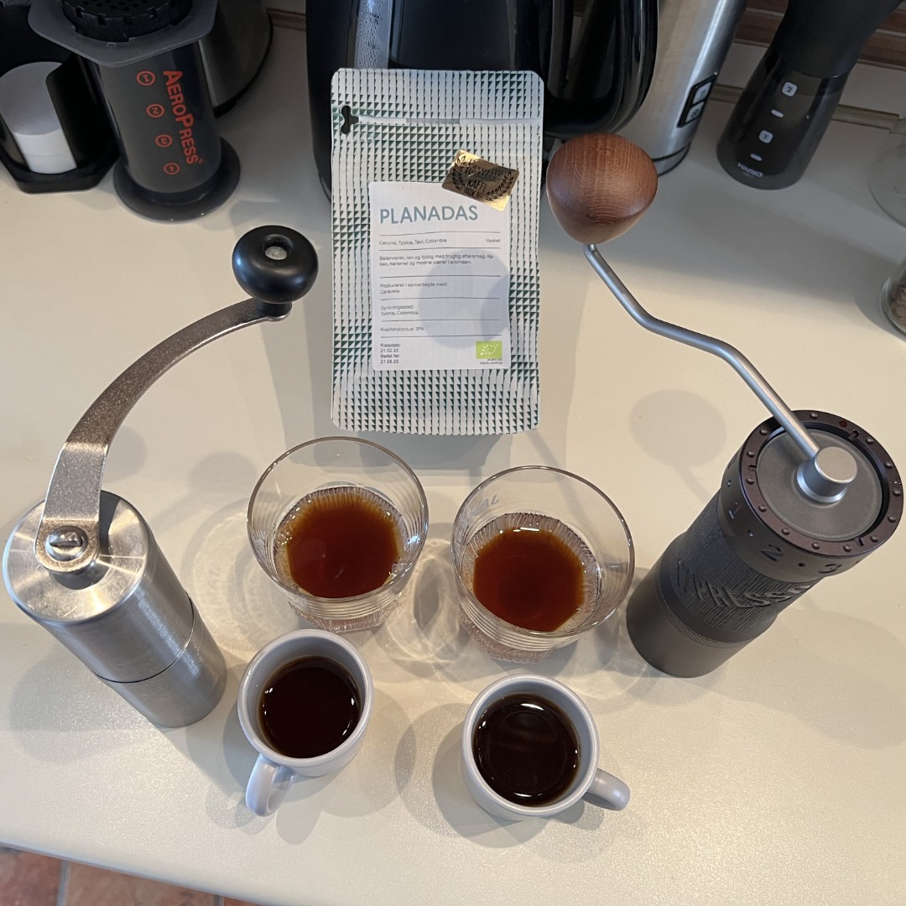

I bought my first real coffee grinder in 2019 in the form of a Porlex Tall. I based my decision solely on the great video that James Hoffmann made comparing cheap hand grinders at the time. Towards the end of 2022, the taste started to get hollow.

## gear acquisition syndrome :gear:

Speaking of that video, I started seeing more and more content related to coffee equipment, which led to the desire to buy something nice. First it was ceramic cups from Sebesi Ceramics, followed by a cutting/serving board from Vinovita.

Remember the part in the introduction where I mentioned that the taste became hollow? That feeling became more pronounced after each visit to a cafe. I had a nice cup of coffee, bought the same beans and made it the same way at home, but the taste wasn't as good. So I decided to buy a top of the line hand grinder. The research was quick and I ordered a 1Zpresso K-Max. After about a month of using it, I can say that it was an excellent decision.

I A/B tested the old and new grinders with a friend of mine using the same coffee and method. We came to the conclusion that we would be happier if the difference wasn't so stark. This is not surprising as the K-MAX grinds as evenly as possible. It produces more fines than I would like, but I can take that trade-off any day of the week because the flavors are excellent. I felt the need to tell my brother about my discovery because he happens to be a food engineer. He made me realize that he had written his thesis on the importance of particle size in powder blends. So it wasn't a surprise to him. Hopefully my honeymoon with my new grinder will last longer than my memory, because I don't want to invest more in this hobby anytime soon. However, I do have some ideas about my future investments... :sweat_smile:

## starting a cult :church:

Late last year, I took my V60 into the office to make a nice cup of coffee after lunch. These things are alien to office kitchens where automatic coffee machines are the norm. At first, everyone thought I was crazy. Months have passed since then. During these months, I received numerous questions about the coffee and the method, as the whole *séance* became an attraction. More curious colleagues asked if they could have a taste. As usual, this was the first step down a slippery slope.

Fast forward a few months, and this ritual of mine became the basis for exploring different types of coffee beans and office socializing. Our company has a very relaxed home office policy, so it was hard for many to feel a sense of belonging once things started to get back to normal after the COVID days. I had that feeling too. It makes me happy to be able to contribute in my own way to bringing the team together. I enjoy coffee more since the whole thing started to develop, and my colleagues enjoy the coffee and the conversations around it. Even my manager has noticed that I now have a cult following as we occupy the main table in the kitchen area.

Giving back to the community helps me enjoy my hobby in a completely different way than before. It pushes me to play my best and help others explore new things. It has also made me realize that I like having a buzz around me, but being the center of attention still freaks me out.
