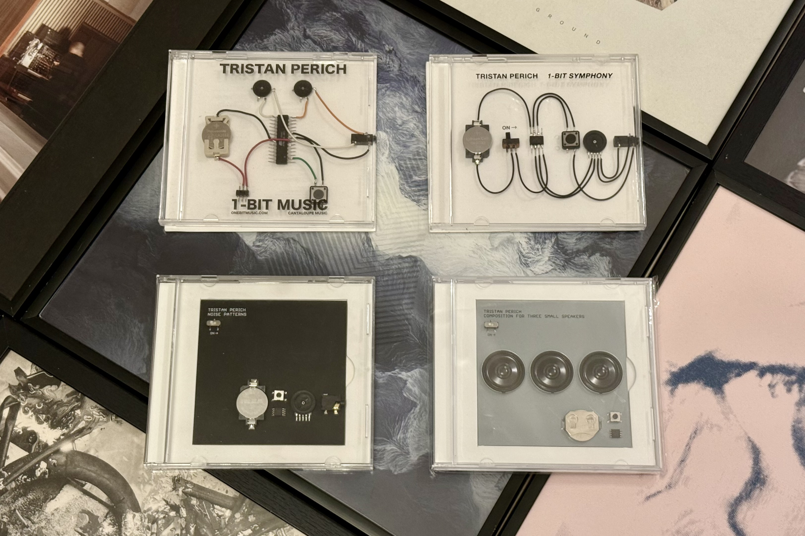
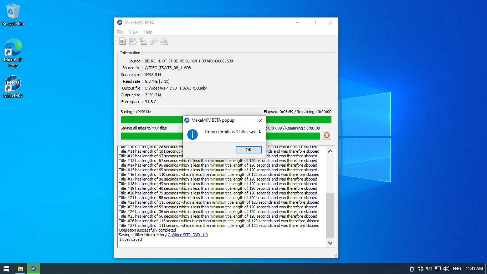
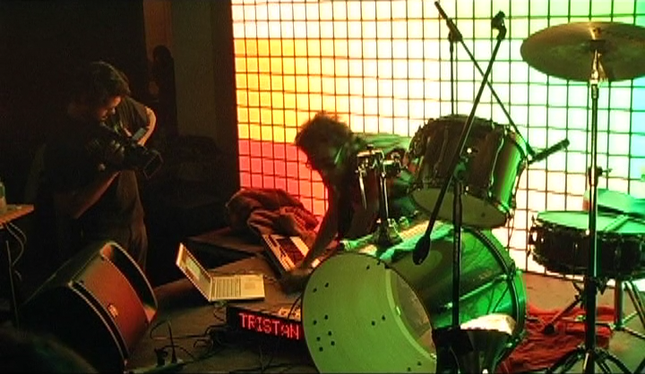

For as long as I can remember, I have been drawn to unusual forms of expression and the idea of repurposing objects to do things they were never intended to do. For me, the purest manifestations of this idea were New York artist Tristan Perich's [*1-Bit Symphony*](https://www.discogs.com/release/6633892-Tristan-Perich-1-Bit-Symphony) and [*Noise Patterns*](https://www.discogs.com/release/8742735-Tristan-Perich-Noise-Patterns) records. They are essentially an electronic circuit mounted in a CD jewel case with a headphone jack on the side. I was so proud to have them in my collection that I even put them on my wall for display.

Towards the end of 2023 I was in a nostalgic mood and decided to check out what this guy was up to lately. To my surprise he released new material — [*Composition For Three Small Speakers*](https://www.discogs.com/release/28982284-Tristan-Perich-Composition-For-Three-Small-Speakers) — on the same medium at Festival Musica, so I took a chance and managed to buy a copy. This made me realize that I still miss the 2007 release of [*1-Bit Music*](https://www.discogs.com/release/2417323-Tristan-Perich-1-Bit-Music), which started this whole 1-bit lo-fi music on an integrated circuit thing.

The best I could do was try my luck on Discogs, but that attempt failed at first. I was not surprised though, as the album in question was a limited edition of 1,000 copies, so I started playing the waiting game. About two months ago, that patience paid off when I managed to acquire a copy after convincing the seller to ship it to Europe.

After the dopamine levels from the joy of having all the physical editions reached normal levels, I started asking myself the following questions:

- How was I introduced to Tristan's work?
- What made me track down and buy his releases?

## a trip down memory lane :floppy_disk:

I started digging deep into my memory and eventually found out how I was introduced to Tristan's work and the whole chiptune scene for that matter. I blame *The Engadget Show*!

In 2009, Engadget started a part talk show, part podcast, part event that I was really into. The theme song was written by *Bit Shifter* and he had a live performance in the first episode. The sound of the Game Boy was instantly recognizable to me, even though I only had a [pirated clone of the NES](https://en.wikipedia.org/wiki/Famiclone#Hungary) on which we played countless hours of *Battle City* with my brother. I was sucked into the beeps for a while and visited the 8 Bit Collective's website frequently to get new tunes.

I was already interested in this vibrant scene, and the 2010 documentary *Reformat the Planet* got me even more excited about it all. The movie is mostly about the NY chiptune scene and captures the height of it from the first Blip Festival to 2008. It had a childishly optimistic tone throughout the movie and it seemed like they had a huge momentum, so it was an uplifting experience to watch it back then.



I was sure that I had seen Tristan in this movie, but I could not remember a single frame, so I decided to watch it again. However, this exercise turned out to be quite an effort in 2024:

- 2 Player Productions' website is unreachable.
- VHX does not accept any of my credit cards.
- No streaming service in my region has it in their rotation.
- The hunt for Ubuntu ISOs was unsuccessful.

What would a sane person do? If you guessed, buy the DVD on eBay and try to play it, you were right.

## watch movies like it's the 2010s :cd:

I buy some of my favorite artists' releases on vinyl, even though I don't own a turntable and, as of 2014, don't have an optical drive in any of my computers. To make matters worse, I don't have access to a DVD player or game console, so getting the disc was the easiest part of watching the movie.

I was well aware of the problem described above and started looking for a solution before the package arrived. I figured I should get an external Blu-ray drive so I could play these types of discs. Playing them is one thing, but I have no faith in the longevity of optical media, so I also wanted to archive the movie on my hard drive.

Thanks to DRM, it comes with its own set of challenges that derailed and delayed the screening quite a bit. Fortunately, I stumbled across the *MakeMKV* forums and found out that there is a solution to all my problems: buy a supported drive and make it [LibreDrive](https://forum.makemkv.com/forum/viewtopic.php?t=18856) compatible by modifying its firmware. I was pretty skeptical about the whole thing, but I wanted to see the movie so badly that I finally pulled the trigger.

I ended up getting a slim internal drive with the intention of putting it in an enclosure later. But I wanted to see the movie as soon as possible, and I had the drive on hand. I tore apart my NAS — which is just a stripped-down laptop I bought for peanuts from one of my former employers — installed Windows on a spare SSD, flashed the right firmware, and hoped for the best...

The whole exercise took more time than I wanted to spend on it, but eventually I emerged victorious and was able to watch the movie.

## cost vs benefit :balance_scale:

Well, it was good, but different from what I remembered from the first time I saw it. I kind of hinted at it above, but I think the movie was the celebration of that era of the chiptune scene. 8 Bit Collective's website is down along with 2 Player Productions', only a few artists' websites are accessible, others have pivoted away from all of this. I've learned that some drama split the community and a large number of members went on to create *ChipMusic.org*, which is obviously not the same thing.

The most pressing issue for me, however, was to see why I was so eager to get all the 1-bit releases. To my surprise, Tristan has about 4 minutes of screen time in the entire movie, including the deleted scenes. It is a pretty short time to make an impression, but there is a lot to unpack if you pay close attention. You can see his other works in the background, like *Drawing Machine (2012)*, which is a Sharpie that makes seemingly random markings on a wall. There is also a performance where he plays drums live to expand the soundscape of *1-Bit Music*.

Looking back on the whole exercise of reconciling with my memories, I can say that it was a fun ride. I learned new things and my perspective was broadened as I made sure that I could finally watch the movie to see why I was so fond of these obscure formats. At first it felt like a burden, but it made me appreciate the journey of overcoming all the obstacles. I'm still unsure of the answer to why, but I think the following quote will be a fitting conclusion:

> You know this stuff wants to be explored. Whenever we create those things I think we have to realize that'll happen and we should embrace it instead of closing off the systems. 
> — Tristan Perich
